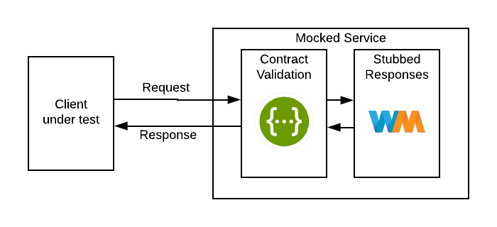
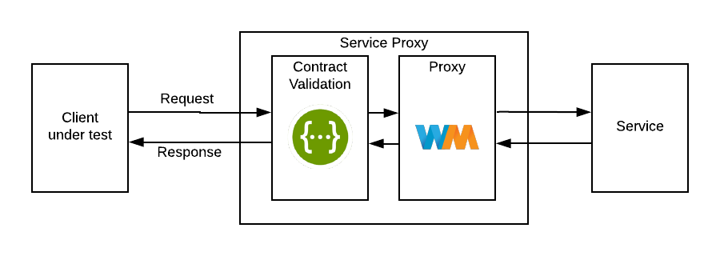

# Wiremock Swagger Extensions

This project combines the power of Wiremock and Swagger and it was
developed so we could test not only our clients (Wiremock) but also the 
contract between client/service (Swagger).

This project contains the following sub-projects:
 * Validator - Wiremock + Swagger validation. This module is responsible 
 for validating all request/responses.
 * Stub Generator - Given a Swagger contract generate all mapping requests 
 and response files.


## Validator

The Swagger Validator is an extension to Wiremock, which means that all wiremock
capabilities are kept intact (Recording, Proxying, Stubbing, etc.).
The most common use of this extension is for **Stubbing** and **Proxying**.  




It was assumed that the Swagger definition is located at **${WORKING_SPACE}/swagger-payload**. It was decided that no 
extension should be provided because the extension will determine automatically which format is being 
used - JSON or YML - without relying on the extension.


### Run as Standalone Process:
It is possible to run Wiremock Swagger Extension as a Standalone Execution Service with the command:
```bash
java -jar wiremock-swagger-validator.jar ${wiremock-options} --swagger-url=${swagger-url}
```
or 
```bash
java -jar wiremock-swagger-validator.jar ${wiremock-options} --extension=org.wiremock.extensions.swagger.SwaggerValidationExtension
```

Using the first configuration, Wiremock uses the defined url to get the swagger definition, store it in the 
**${WORKING_SPACE}** and enables automatically the extension. 
On the second configuration, the extension is manually configured and the swagger definition should be provided 
as a file at **${WORKING_SPACE}/swagger-payload**. 


### Run as Docker/Docker Compose
It is possible to run Wiremock Swagger Extension as a Docker container. Check **validator-it**.


## Stub Generator

On-going
